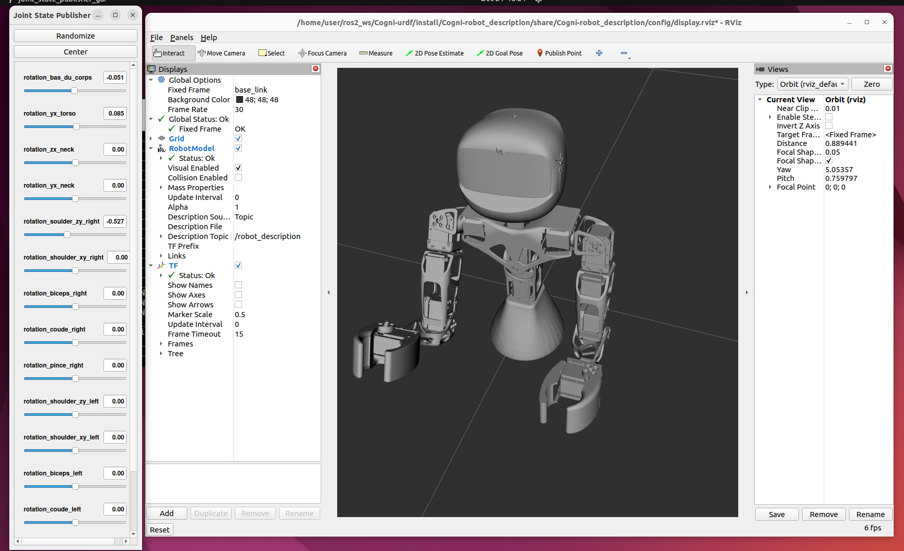

# Cogni-urdf

Ce dépôt contient le fichier URDF *(Unified Robot Description Format)* du projet Cogni, avec une configuration pour l'executer dans Rviz et le relier à des nodes ros2.

démonstration dans Rviz:


## Installation

#### Prérequis:
    * ros2-humble (de préférence)
    * python
    * colcon

#### Commandes:

```bash
# Cloner le repo
git clone https://github.com/Cogni-robot/Cogni-urdf

# Le déplacer vers votre dossier ros2
mv Cogni-urdf ~/ros2_ws
cd ~/ros2_ws/Cogni-urdf

# Compiler le projet
colcon build

# sourcer l'instance ros2
source install/setup.bash

# Lancer la simulation
ros2 launch Cogni-roto_description display.launch.py
```